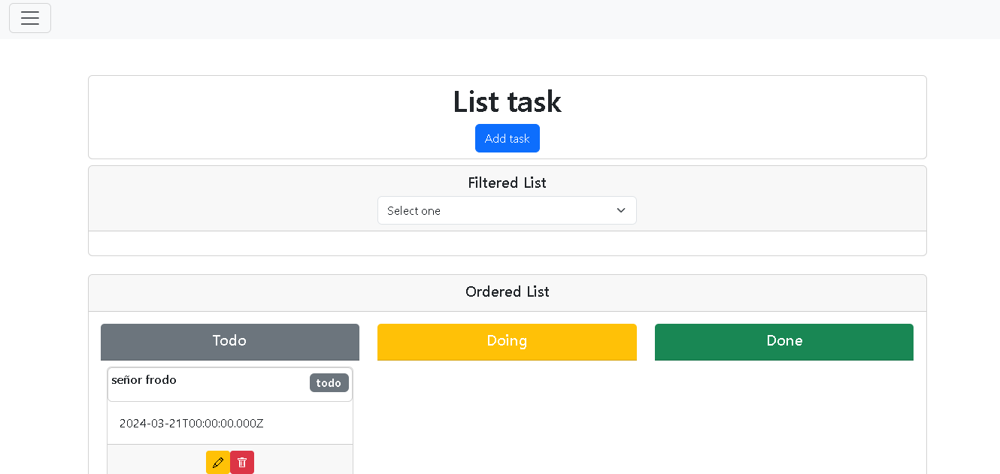

# React + TypeScript + Vite

### 1-Como correr el proyecto
1. Instalar las dependencias con ***npm install***
2. Correr el proyecto con ***npm run dev***

### 2- Descripción
El proyecto desarrollado consume una API que permite realizar un CRUD de tareas, además de búsquedas por estado (todo, doing, done) y por id. 
Contiene 2 páginas:
1. Profile: contiene información del usuario
2. Tasks: contiene el CRUD; en cada una de las operacion se muestra un mensaje de éxito o error en la parte inferior derecha, tiene 2 listas una que se filtra con un
dropdown con los estados y otra separada por cada uno de los estados
### 3- Resultado final de la aplicación

### 4 Stack utilizado
- Vite React con Typescript
- Bootstrap 5.3
- React-router-dom 6.22

### 5 Comentario
Esta prueba me dio a conocer que necesito aprender y prácticar más, he logrado identificar puntos de mejora. Fué muy entrenido, algunas cosas que no sabía las investigué otras solo las apliqué
